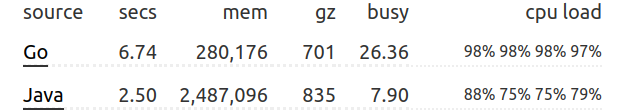
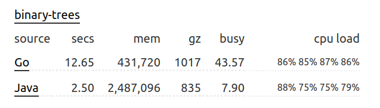
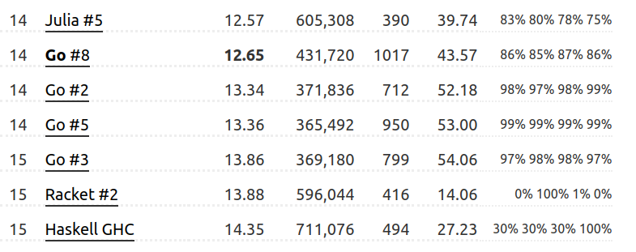

# The Computer Language Benchmarks Game

[Binary-trees](https://benchmarksgame-team.pages.debian.net/benchmarksgame/performance/binarytrees.html)  
[Home page](https://benchmarksgame-team.pages.debian.net/benchmarksgame/index.html)  


## Twofold Speedup
[My code](https://benchmarksgame-team.pages.debian.net/benchmarksgame/program/binarytrees-go-4.html)  
[measurements](https://benchmarksgame-team.pages.debian.net/benchmarksgame/measurements/go.html)  



```sh
	time go run . 21 > out1.txt
# real    0m9.732s
# user    0m56.404s
# sys     0m0.535s
```

[Online version](https://benchmarksgame-team.pages.debian.net/benchmarksgame/program/binarytrees-go-8.html):
```sh
	time go run ./19s/main.go 21 > out2.txt
# real    0m21.050s
# user    2m10.221s
# sys     0m2.067s

	diff out1.txt out2.txt

twofold speedup:
# real 	21.050/9.732 = 2.16x
# user  130.221/56.404 = 2.3x
# sys   2.067/0.535 = 3.86x
```
---

```sh
java --version
# java 14.0.2 2020-07-14
time javac -d . -cp . binarytrees.java
# real    0m0.883s
# user    0m2.255s
# sys     0m0.081s
time java  -cp . binarytrees 21
# real    0m3.275s
# user    0m16.464s
# sys     0m1.034s
go version
# go version go1.15.5 linux/amd64

go clean
time go build -ldflags=-s
# real    0m0.288s
# user    0m0.324s
# sys     0m0.073s
time ./benchmarksgame 21
# real    0m7.340s
# user    0m37.112s
# sys     0m0.664s

time go run -ldflags=-s . 21
# real    0m7.780s
# user    0m38.393s
# sys     0m0.801s
```
```sh
# debug.SetGCPercent(-1) 
# real    0m5.195s
# user    0m17.625s
# sys     0m2.338s
```
# Original

[link](https://benchmarksgame-team.pages.debian.net/benchmarksgame/program/binarytrees-go-8.html)



```sh
go build -ldflags=-s .
time ./main 21
real    0m19.341s
user    2m3.085s
sys     0m2.060s
```
# Output

```sh
stretch tree of depth 22         check: 8388607
2097152  trees of depth 4        check: 65011712
524288   trees of depth 6        check: 66584576
131072   trees of depth 8        check: 66977792
32768    trees of depth 10       check: 67076096
8192     trees of depth 12       check: 67100672
2048     trees of depth 14       check: 67106816
512      trees of depth 16       check: 67108352
128      trees of depth 18       check: 67108736
32       trees of depth 20       check: 67108832
long lived tree of depth 21      check: 4194303
```
# Profiling
This is the Go Profiling output, if you are interested (80% for memory managment, 20% main.create+main.node.check):  
```sh
Showing nodes accounting for 15.49s, 85.44% of 18.13s total
Dropped 153 nodes (cum <= 0.09s)
Showing top 20 nodes out of 68
      flat  flat%   sum%        cum   cum%
     4.88s 26.92% 26.92%     10.90s 60.12%  runtime.mallocgc
     1.29s  7.12% 34.03%     13.34s 73.58%  main.create
     1.29s  7.12% 41.15%      1.29s  7.12%  runtime.nextFreeFast
     1.25s  6.89% 48.04%      1.90s 10.48%  runtime.heapBitsSetType
     1.03s  5.68% 53.72%      1.03s  5.68%  main.node.check
     0.97s  5.35% 59.07%      2.58s 14.23%  runtime.scanobject
     0.66s  3.64% 62.71%      0.81s  4.47%  runtime.heapBitsForAddr (inline)
     0.64s  3.53% 66.24%     11.54s 63.65%  runtime.newobject
     0.50s  2.76% 69.00%      0.53s  2.92%  runtime.pageIndexOf (inline)
     0.49s  2.70% 71.70%      0.70s  3.86%  runtime.findObject
     0.40s  2.21% 73.91%      0.40s  2.21%  runtime.acquirem (inline)
     0.33s  1.82% 75.73%      0.33s  1.82%  runtime.memclrNoHeapPointers
     0.27s  1.49% 77.22%      2.64s 14.56%  runtime.gcDrain
     0.26s  1.43% 78.65%      0.26s  1.43%  runtime.releasem (inline)
     0.23s  1.27% 79.92%      0.49s  2.70%  runtime.gcWriteBarrier
     0.22s  1.21% 81.14%      0.81s  4.47%  runtime.greyobject
     0.20s  1.10% 82.24%      0.20s  1.10%  runtime.(*gcWork).putFast (inline)
     0.20s  1.10% 83.34%      0.20s  1.10%  runtime.arenaIndex (partial-inline)
     0.20s  1.10% 84.45%      0.20s  1.10%  runtime.futex
     0.18s  0.99% 85.44%      0.20s  1.10%  runtime.spanOf (inline)
```

# Disable GC

```sh
Showing nodes accounting for 12.87s, 96.99% of 13.27s total
Dropped 51 nodes (cum <= 0.07s)
Showing top 20 nodes out of 27
      flat  flat%   sum%        cum   cum%
     4.28s 32.25% 32.25%      9.83s 74.08%  runtime.mallocgc
     1.80s 13.56% 45.82%     12.26s 92.39%  main.create
     1.25s  9.42% 55.24%      1.25s  9.42%  runtime.memclrNoHeapPointers
     1.25s  9.42% 64.66%      1.25s  9.42%  runtime.nextFreeFast
     1.03s  7.76% 72.42%      1.71s 12.89%  runtime.heapBitsSetType
     0.97s  7.31% 79.73%      0.97s  7.31%  main.node.check
     0.63s  4.75% 84.48%     10.46s 78.82%  runtime.newobject
     0.46s  3.47% 87.94%      0.46s  3.47%  runtime.acquirem
     0.45s  3.39% 91.33%      0.68s  5.12%  runtime.heapBitsForAddr (inline)
     0.23s  1.73% 93.07%      0.23s  1.73%  runtime.arenaIndex
     0.18s  1.36% 94.42%      0.18s  1.36%  runtime.releasem
     0.09s  0.68% 95.10%      0.09s  0.68%  runtime.divRoundUp (inline)
     0.07s  0.53% 95.63%      0.23s  1.73%  runtime.(*mheap).allocSpan
     0.06s  0.45% 96.08%      0.07s  0.53%  runtime.makeSpanClass
     0.05s  0.38% 96.46%      0.08s   0.6%  runtime.(*mspan).nextFreeIndex
     0.02s  0.15% 96.61%      1.70s 12.81%  runtime.(*mcache).nextFree
     0.02s  0.15% 96.76%      1.47s 11.08%  runtime.(*mheap).alloc
     0.01s 0.075% 96.83%      1.56s 11.76%  runtime.(*mcentral).cacheSpan
     0.01s 0.075% 96.91%      1.54s 11.61%  runtime.(*mcentral).grow
     0.01s 0.075% 96.99%      0.24s  1.81%  runtime.(*mheap).alloc.func1
```
[issues/391](https://salsa.debian.org/benchmarksgame-team/benchmarksgame/-/issues/391)  
